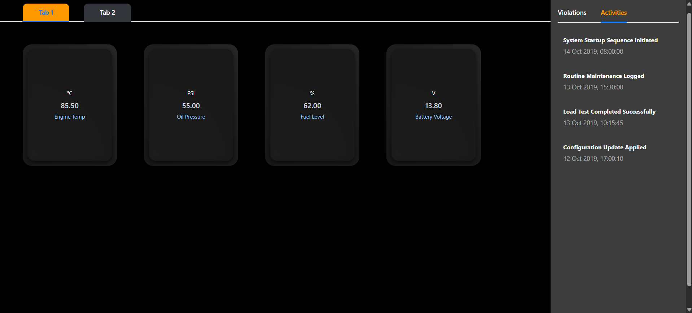
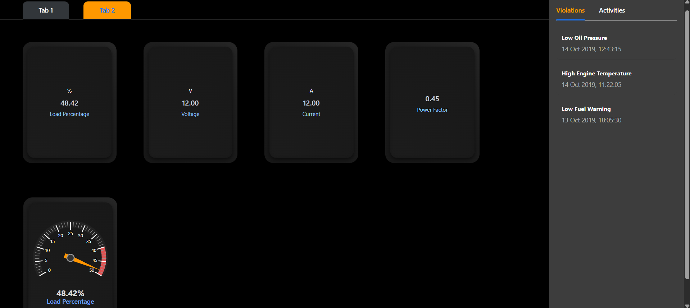
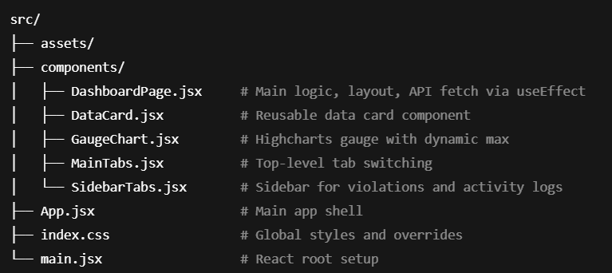

React Dynamic Dashboard
    A responsive and interactive single-page dashboard built using React, Ant Design, and Highcharts. It dynamically fetches and displays data through reusable UI components with a focus on clean layout, modularity, and reliable error/loading handling.

Preview of the DashBoard:

Tab 1:

Tab 2:

Features:

Single Page Application built with React and Vite

Dynamic Data Fetching via useEffect from: 
        https://dummyjson.com/c/fce7-da87-4904-b310

Tabs for Navigation:
        tab1Data: Displays stats in reusable DataCards
        tab2Data: Displays stats and a dynamically scaled GaugeChart

Sidebar:
        Displays violations and activities using SidebarTabs

Reusable Components
        DataCard: Displays value, label, and unit
        GaugeChart: Highcharts-based meter with a dynamic max value from API data

Robust UX:
        Loading state handled with Ant Design’s Spin
        Error messages using message.error when API fails

Styling:
        Ant Design components with custom CSS overrides

Folder Structure with summary of each file's basic function:

Tech Stack
    React (Functional Components + Hooks)
    Vite (for fast development)
    Ant Design for UI layout and components
    Highcharts via highcharts-react-official
    Custom CSS for styling enhancements

Installation & Setup:

# Clone the repository
git clone https://github.com/Ishani018/Dashboard.git

# Install all dependencies
npm install

# Start the development server
npm run dev

How It Works:
Data Fetching: Done in DashboardPage.jsx using useEffect on mount

Dynamic Tabs: Extracts all API keys ending in Data (e.g., tab1Data, tab2Data) to generate dynamic tabs

Sidebar: Reads sidebarData and displays recent violations and activities

GaugeChart:
        Renders only in tab2
        Dynamically adjusts its max value based on the highest incoming data point# Dashboard

